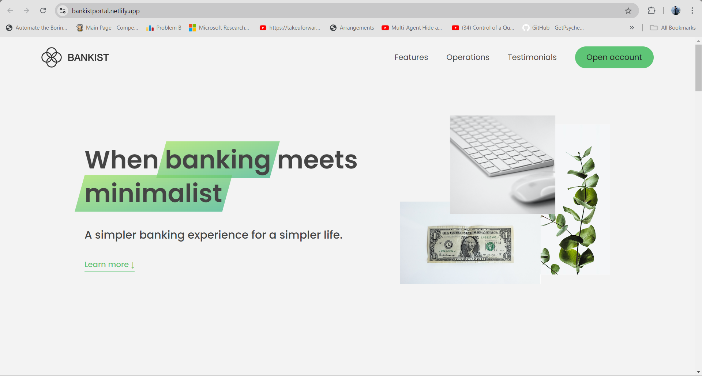
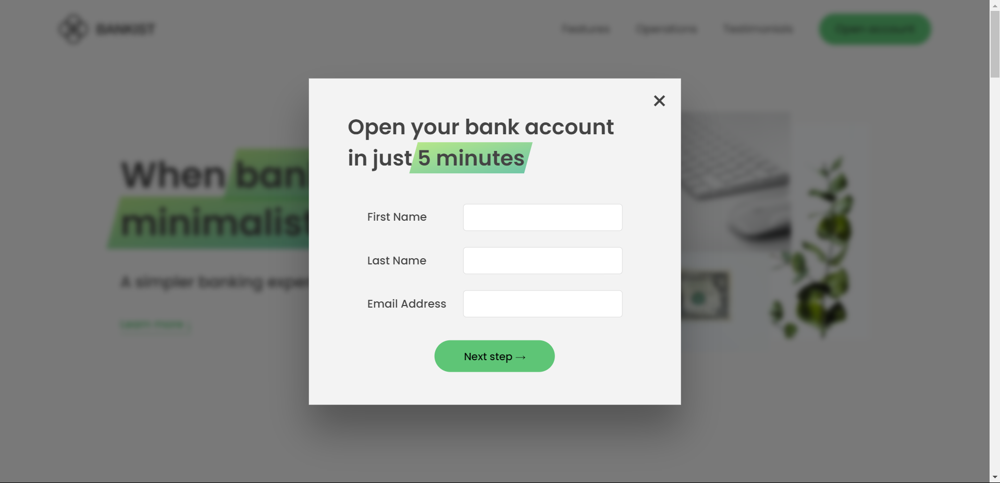
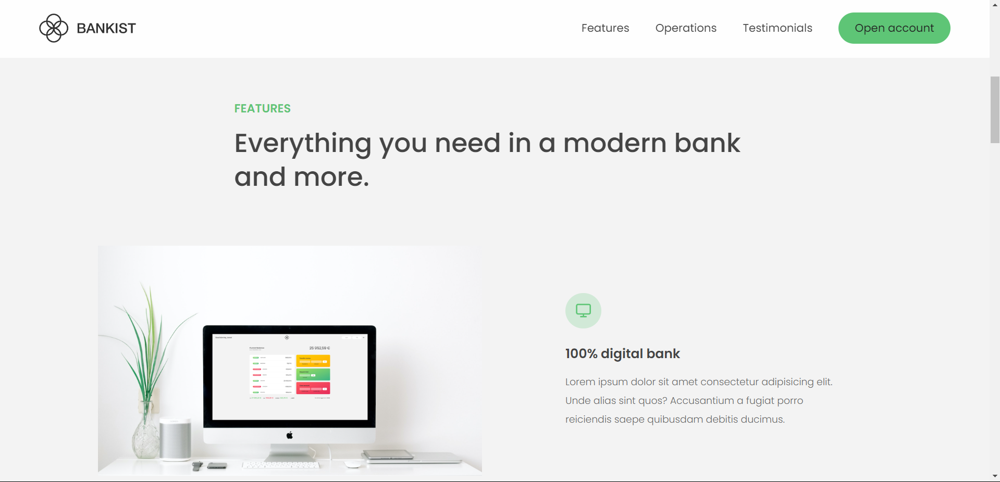
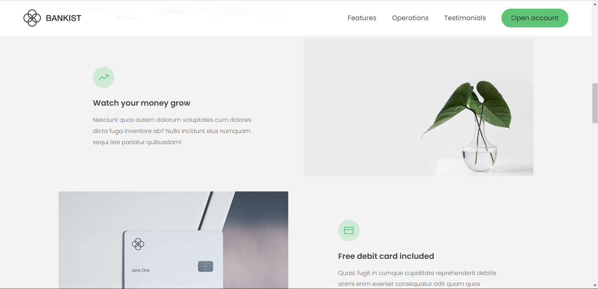
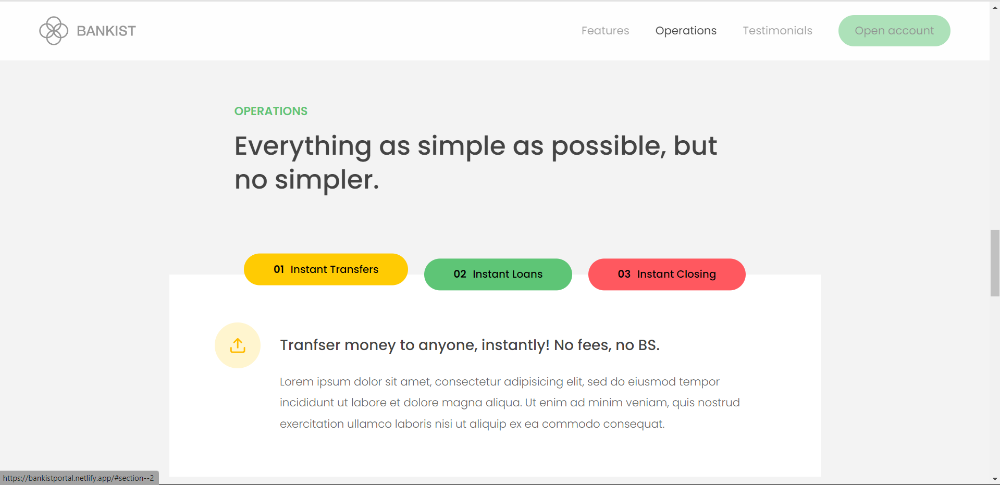
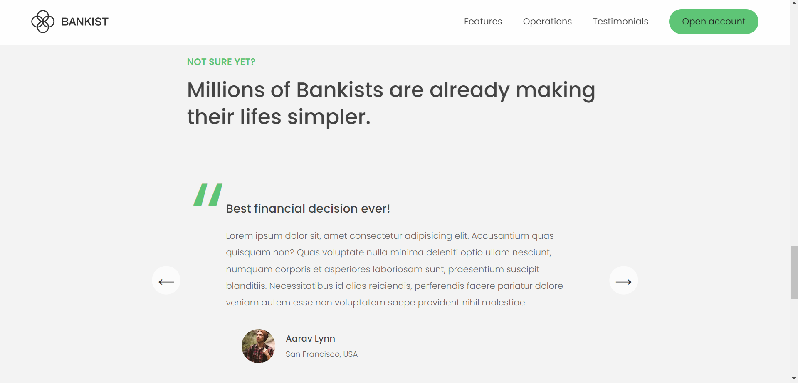
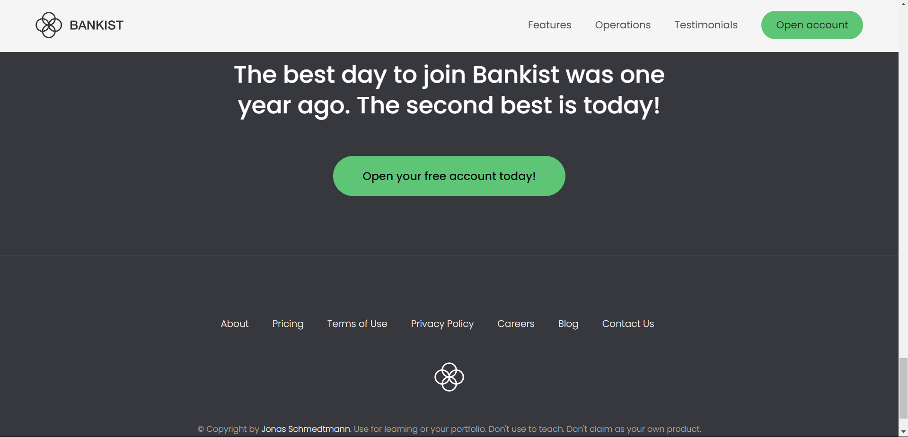

# Click below link for Bankist v1.0 beta source code 
https://github.com/Pransu-code/FundFusion

## Below is another Website for banking experience make sure to checkout ( ps : you won't regret )


This is the first version of this banking website, UI is 100% functional.
---

# Bankist

## Description

**Bankist** is a minimalistic yet feature-rich web application that provides users with a seamless banking experience. Built using JavaScript, HTML, and CSS, Bankist allows users to open accounts, manage their finances, and perform various banking operations through an aesthetically pleasing and user-friendly interface.

## Demo

https://bankistportal.netlify.app/

## Screenshots










## Features to be implemented i V2

- User Registration and Account Creation
- User Authentication and Login
- Account Balance Overview
- Money Transfers between Users
- Loan Requests and Approvals
- Deposits and Withdrawals
- Transaction History
- Responsive Design for Optimal Viewing on Any Device

## Technologies Used

- HTML
- CSS
- JavaScript


## Getting Started

### Prerequisites

To run this project locally, you need a web browser (e.g., Chrome, Firefox, Safari).

### Installation

1. Clone the repository:

```bash
git clone https://github.com/your-username/bankist.git
```

2. Navigate to the project directory:

```bash
cd bankist
```

3. Open `index.html` in your web browser:

```bash
open index.html
```

## Project Structure

```
bankist/
│
├── index.html       # The main HTML file
├── styles.css       # The main CSS file
├── script.js        # The main JavaScript file
└── assets/          # Folder for images, icons, etc.
```

## Code Explanation

### HTML

The HTML file contains the structure of the app, including forms for registration, login, and financial transactions, as well as elements for displaying user information.

### CSS

The CSS file contains styles to create a visually appealing and responsive user interface. It includes layout styles, colors, fonts, and media queries for different screen sizes.

### JavaScript

The JavaScript file contains the logic for:
- User authentication
- Handling financial transactions (transfer, deposit, withdraw)
- Loan requests
- Updating the UI with user data
- Managing the transaction history

## Contributing

Contributions are welcome! If you have any suggestions or improvements, feel free to open an issue or submit a pull request.

## License


## Acknowledgments

